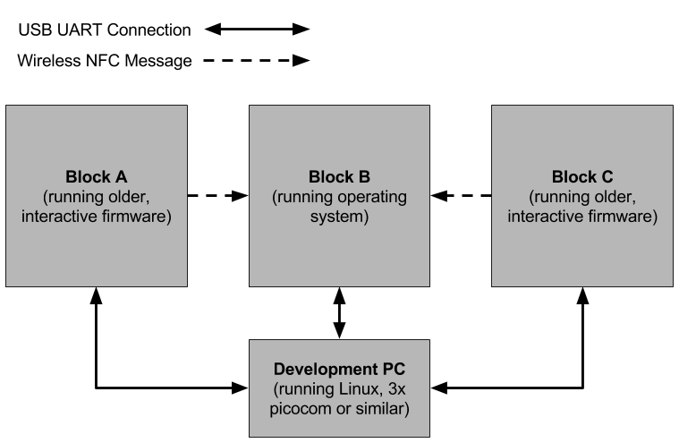

## Introduction
In this section of the project we must perform simultaneous communication between three or more smartblocks. To start with, we will need the code from [this directory](../code/block-peripheral-controllers), which contains the driver classes `CLEDController` and `CNFCController`. A class called `CPortController` is also included in this directory and is required for controlling the port multiplexer so that the remote LEDs and NFC devices can be accessed.

## Instructions
1. The port controller is used to select one of the connected faces. Once a connected face is selected, the `CTWController` can be used via the `CLEDController` and the `CNFCController` to configure and control the LEDs and the NFC transciever on that face. The first step will be to modify the `CPortController` such that it can be _locked_ by a task running on the OS.

2. To test if the port controller is lockable and working correctly, create a simple task that configures the colors of each LED on each face of the block. Depending on how the system for locking resources such as the `CTWController` works, you may need to make `CPortController` and `CLEDController` lockable as well, and have them in turn lock the `CTWController`. You may find the following code useful for configuring the LEDs. You will need to run `CLEDController::Init` on each face and should set the mode of the LEDs to `CLEDController::EMode::PWM` before setting the color.

```c++
#define RGB_RED_OFFSET    0
#define RGB_GREEN_OFFSET  1
#define RGB_BLUE_OFFSET   2
#define RGB_UNUSED_OFFSET 3

#define RGB_LEDS_PER_FACE 4

/***********************************************************/

void SetAllColorsOnFace(uint8_t unRed, uint8_t unGreen, uint8_t unBlue) {
   for(uint8_t unLedIdx = 0; unLedIdx < RGB_LEDS_PER_FACE; unLedIdx++) {
      CLEDController::SetBrightness(unLedIdx * RGB_LEDS_PER_FACE +
                                    RGB_RED_OFFSET, unRed);
      CLEDController::SetBrightness(unLedIdx * RGB_LEDS_PER_FACE +
                                    RGB_GREEN_OFFSET, unGreen);
      CLEDController::SetBrightness(unLedIdx * RGB_LEDS_PER_FACE +
                                    RGB_BLUE_OFFSET, unBlue);
   }
}

/***********************************************************/

void SetAllModesOnFace(CLEDController::EMode e_mode) {
   for(uint8_t unLedIdx = 0; unLedIdx < RGB_LEDS_PER_FACE; unLedIdx++) {
      CLEDController::SetMode(unLedIdx * RGB_LEDS_PER_FACE 
                              + RGB_RED_OFFSET, e_mode);
      CLEDController::SetMode(unLedIdx * RGB_LEDS_PER_FACE +
                              RGB_GREEN_OFFSET, e_mode);
      CLEDController::SetMode(unLedIdx * RGB_LEDS_PER_FACE +
                              RGB_BLUE_OFFSET, e_mode);
      CLEDController::SetMode(unLedIdx * RGB_LEDS_PER_FACE +
                              RGB_UNUSED_OFFSET, CLEDController::EMode::OFF);
   }
}

```

3. Extend the task in the previous step so that it can be run concurrently with other instances of itself. For example, perhaps create a task which controls the LEDs on one face of block and instruct the OS to start six instances of this task, all sharing the `CPortController`, `CLEDController`, and `CTWController`.

4. Similar to the `CLEDController`, the `CNFCController` requires that the target face is first selected using the `CPortController` and internally uses the `CTWController`. It is highly recommended to load the [original firmware](https://github.com/allsey87/smartblock-bsp) on to two smartblocks and send data between them. This requires connecting to the block's UART over a USB cable using Putty or Picocom with a baud rate of 57600. The command interface for this firmware can be seen on [line 525 of firmware.cpp](https://github.com/allsey87/smartblock-bsp/blob/master/firmware/source/firmware.cpp#L525). It consists of single byte commands, which can be entered using a keyboard. The command `t` will attempt to send an NFC message out of the first connected face port. Running this test will verify if the hardware is working correctly. Receiving a message is interrupt driven and handled partially by the `CPortController`. It is strongly recommended to spend some time modifying and testing this code so that it is properly understood before continuing. In particular, make sure it is understood how the interrupt functions in `CPortController` are used when receiving a message and how the `CNFCController` is initialized and powered down.

5. Similar to the first step, add the `CNFCController` into the operating system code. Depending on the operating system's implementation, you may need to make the `CNFCController` lock the `CTWController`. [Line 501 of the implementation for the `CNFCController`](../code/block-peripheral-controllers/nfc_controller.cpp#L501) contains a method called `read_dt`. This function implements busy-wait loop, which blocks on remote IO (i.e. it waits for communication between the microcontroller and the NFC controller chip). Unlocking the `CPortController` and `CTWController` as well as calling the `sleep` or `yield` method of the operating system while waiting on remote IO is the key to enabling simultaneous communication.

6. To test the integration of the `CNFCController` into the operating system code, create a simple task which checks the `CPortController` for interrupts every 5-10 ms. If an interrupt is detected, spawn a new task to handle receiving this message. Upon receiving a message, print the (i) port number, (ii) system time, and (iii) message contents to the `CHUARTController` before terminating this task. For this test, it is recommended to have one block running the OS, and the other running the older firmware, which interactive and controllable over USB.

7. If simultaneous communication is working as expected, it should be possible to recieve a message on two faces almost at the same time. As in the following diagram, setup an experiment using three blocks. Each of these blocks should be connected to a PC (or multiple PCs if this is easier) using USB cables. To complete this experiment, send the keystroke `t` to blocks A and C, which are running the old interactive firmware. This will trigger blocks A and C to send an NFC message to block B at almost the same time. If everything works correctly, the operating system will create two tasks to handle the inbound NFC messages and print them to the `CHUARTController`, automatically locking and unlocking the `CTWController` as required.


