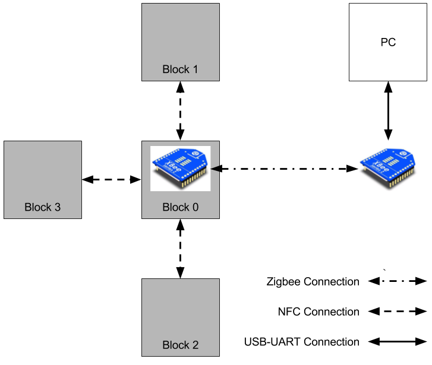
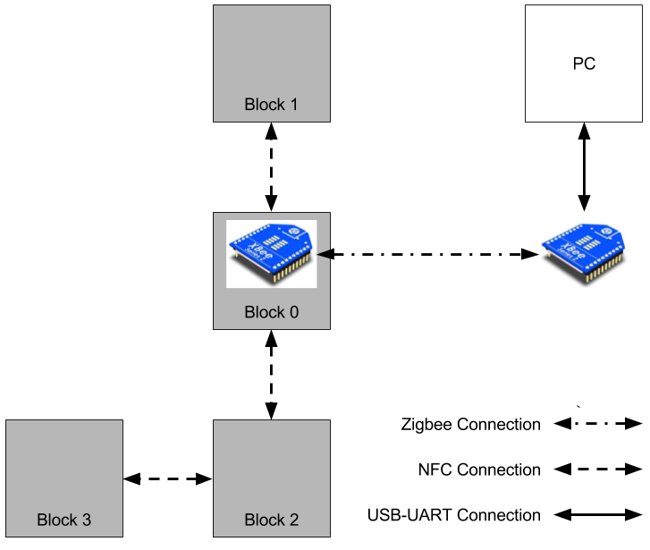
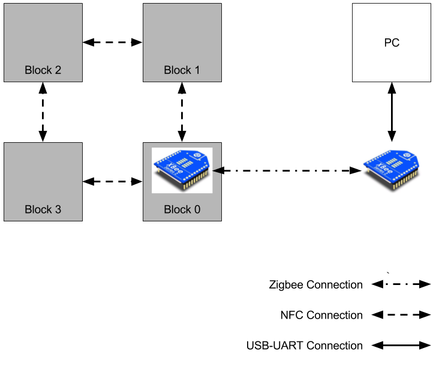

## Introduction
This part of the project is somewhat flexible. A demonstration is required that show some level of remote control or monitoring of a remote structure. The remote link is provided using an Xbee module, a small radio based on the Zigbee standard.

At a minimum, you should be able to send a message from a PC with an Xbee module to a block in a structure with an Xbee module. When a message is recieved the 

